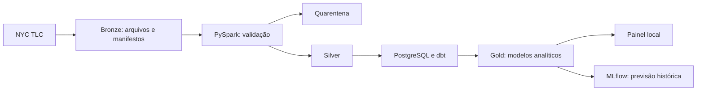

# UrbanFlow — engenharia de dados e mobilidade

> Dos dados brutos de viagens a um painel analítico: um projeto de engenharia de dados com qualidade, rastreabilidade e execução local.

**PySpark · PostgreSQL · dbt Core · MLflow · Python**

[Ver demonstração](#visualizar-a-demonstração-sem-processar-dados) · [Executar pipeline](#começar-localmente) · [Resultados e limites](docs/validation.md)

## O projeto em 30 segundos

- **Problema:** transformar arquivos públicos de viagens em dados confiáveis para analisar embarques por zona e hora.
- **Solução:** ingestão versionada, validação em PySpark, quarentena, carga no PostgreSQL e modelos analíticos em dbt.
- **Entrega:** painel local com cinco páginas e experimentos de previsão histórica rastreados no MLflow.
- **Execução documentada:** janeiro/2024, com 2.964.624 registros de entrada, 2.963.695 aceitos e 929 em quarentena.
- **Qualidade documentada:** 6 modelos e 10 testes dbt, além de 12 testes Python aprovados na validação local. Veja as condições em [docs/validation.md](docs/validation.md).



## Escopo e tecnologias


Pipeline de portfólio em **PySpark + PostgreSQL + dbt Core**, com simulação histórica de embarques por zona/hora, MLflow e painel local. Dados públicos NYC TLC Yellow Taxi. **Execução local gratuita, sem conta cloud e sem deploy de infraestrutura.**

AWS é a arquitetura alvo documentada; Terraform e entrada Glue são referências para revisão, não infraestrutura em operação. O fluxo local funciona sem AWS. O **BI local UrbanFlow é a interface principal**: executivo, mobilidade, previsões, saúde e arquitetura. Não há dependência de Power BI. Databricks aparece como proposta documentada de evolução para lakehouse; não foi utilizado na execução medida.

## Começar localmente

Clone este repositório e abra PowerShell na raiz. Instale Python 3.11 e Java 17; crie a venv com `python -m venv .venv` e instale as dependências com `./.venv/Scripts/python.exe -m pip install -r requirements.txt`. Use PostgreSQL via Docker Compose ou extraia os binários oficiais em `.runtime/pgsql`, conforme abaixo. Os ambientes e binários da máquina de validação não são distribuídos no Git.

```powershell
# Iniciar o banco se estiver parado (somente loopback)
./scripts/postgres-local.ps1 start
$env:JAVA_HOME='C:/Program Files/Java/jdk-17'
$env:PYTHONPATH='src'

# Primeira execução real: um arquivo mensal completo, teto 64 MiB
./.venv/Scripts/python.exe -m urbanflow.cli ingest --months 2024-01 --full --max-mb 64
./.venv/Scripts/python.exe -m urbanflow.cli run --kind public_full --months 2024-01

# Abrir o painel em http://127.0.0.1:8080
./.venv/Scripts/python.exe -m urbanflow.cli serve
```

Se a Gold já passou e só a exportação/ML falhou, use `python -m urbanflow.cli export`; ele lê `artifacts/warehouse_checkpoint.json`. Não use checkpoint antigo depois de trocar manualmente o conteúdo do banco.

Para recriar o ambiente: Python 3.11, Java 17, `python -m venv .venv`, ativar a venv e `pip install -r requirements.txt`. Dependências são gratuitas. Nenhuma configuração global de Java é necessária; JAVA_HOME é apenas do processo. No Windows sem Docker, baixe os [binários oficiais PostgreSQL](https://www.postgresql.org/download/windows/) e extraia para `.runtime/pgsql`; o script local inicializa apenas `.runtime/pgdata`. Senha de desenvolvimento: `urbanflow_local_only`; bind em 127.0.0.1. Pare com `./scripts/postgres-local.ps1 stop`.

## Visualizar a demonstração sem processar dados

O repositório inclui o snapshot agregado validado de janeiro/2024 e as geometrias públicas das zonas. Para abrir as cinco páginas, basta executar `python -m http.server 8080 --bind 127.0.0.1 --directory dashboard` e acessar http://127.0.0.1:8080. Isso não requer Spark nem banco. O snapshot não é atualizado automaticamente.

## Docker Compose

```sh
docker compose up -d postgres
docker compose --profile pipeline run --rm pipeline python -m urbanflow.cli fixture --months 2024-01
docker compose --profile pipeline run --rm pipeline python -m urbanflow.cli ingest --months 2024-01 --full --max-mb 64
docker compose --profile pipeline run --rm pipeline python -m urbanflow.cli run --kind public_full --months 2024-01
docker compose --profile dashboard up -d dashboard
```

PostgreSQL e dashboard são expostos somente em localhost. `docker compose down` encerra serviços e preserva volume do banco. Não use `down -v` se quiser preservar o banco. Compose foi fornecido para reprodução; confira em `docs/validation.md` se a execução Docker foi efetivamente testada neste host.

## Dados, ETL e ELT

- **Ingestão**: URL pública com limite de bytes, checksum SHA256, ETag, proveniência, manifesto por mês e versão. ETag igual + checksum local válido evita novo download. Correção na origem gera uma nova versão, preservando a anterior.
- **ETL**: PySpark lê Bronze, valida schema, converte colunas, calcula duração, separa quarentena e reconcilia entrada = aceitos + rejeitados. Gate crítico exige linhas aceitas e rejeição <=5%. Só então troca o ponteiro Silver.
- **ELT**: Silver carregada por COPY no PostgreSQL em schema isolado; dbt transforma em dimensões, fato viagem e fato zona/hora. Testes e reconciliação passam antes da troca transacional das views analytics. Igualdade de campos NÃO é chave de viagem: não há deduplicação cega.
- **Memória**: Spark local[2], reparticionamento antes de streaming para Arrow; batches Python de 10 mil. ML usa somente agregados, com orçamento explícito de linhas/memória. Não faz pandas collect de viagens detalhadas. A implementação local de saída prioriza portabilidade Windows; em Glue usar escrita distribuída nativa.
- **Reexecução**: único escritor por data root; lock impede concorrência. Bronze/Silver iguais são reutilizadas. PostgreSQL reconstrói o snapshot selecionado, sem append duplicado. `--months` define TODO o snapshot ativo: meses não selecionados deixam as views ativas, mas arquivos anteriores permanecem. Schemas históricos ocupam espaço; limpeza é manual e fora deste fluxo.

`config.json` inicia com três meses configuráveis; a validação real inicial usa apenas janeiro. Para expandir, ingira meses adicionais e rode com a lista completa. Para 12 meses, amplie orçamento ML conscientemente e prefira treinamento por regiões/janelas; o limite padrão pode bloquear a expansão. Não baixar tudo antes de validar um mês.

O modo `ingest` sem `--full` limita o download a 16 MiB e tenta o primeiro row group. Um row group pode ultrapassar esse orçamento: nesse caso falha sem promover. Não é amostra probabilística, não representa contagem total e tem ML bloqueado. `fixture` gera dados SINTÉTICOS separados para testes:

```sh
python -m urbanflow.cli fixture --months 2024-01
python -m urbanflow.cli run --kind synthetic --months 2024-01
```

O fixture também usa a tabela oficial de zonas, obtida na ingestão. Nunca misturar synthetic/public_sample/public_full no mesmo snapshot.

## Ciência de dados sem leakage

Alvo: quantidade de registros aceitos de embarque na próxima hora por zona. Lags 1/24/168h e médias 24/168h sempre com shift(1). Lacunas e horários ambíguos/inexistentes do DST permanecem desconhecidos. Arquivo parcial não permite completar zeros nem treinar.

Split temporal por timestamps globais: 60% treino, 20% validação para selecionar complexidade, 20% teste final; refit somente antes do teste. Baseline da mesma hora da semana anterior versus HistGradientBoostingRegressor (scikit-learn). Avaliação rolling one-step: as observações da hora anterior ficam disponíveis **na simulação**. TLC publica mensalmente, portanto esse cenário não é uma previsão operacional ao vivo. Um mês fornece apenas avaliação preliminar, sem validação sazonal anual nem intervalos de incerteza calibrados.

MAE/WAPE globais, por borough e zona, denominador zero → null. Sem promessa de superar o baseline. Previsões têm cutoff e versão SHA256 do modelo. MLflow local usa SQLite e arquivos; não chama serviço hospedado. Artefatos em `artifacts/public_full/ml/`.

Para explorar os experimentos, na venv: `python -m mlflow ui --backend-store-uri sqlite:///artifacts/public_full/ml/mlflow.db --host 127.0.0.1 --port 5000`. Encerrar com Ctrl+C. Esse comando inicia somente a interface local.

## Entregáveis e verificação

`dashboard/`: cinco páginas (executivo, mobilidade, previsões, saúde e arquitetura). `artifacts/`: CSVs, métricas, modelo, logs dbt e MLflow. `data/`: Bronze, Silver, quarentena, manifestos e logs. `docs/`: dicionário, arquitetura Mermaid, BI local e evolução Databricks, roteiro de demo e decisões. `infra/`: Terraform de referência AWS, com gaps explicitados.

```sh
python -m pytest -q
python scripts/validate_static.py
node --check dashboard/app.js
```

CI em `.github/workflows/ci.yml` é **manual**, sem disparo remoto neste trabalho. Para publicar como repo independente, coloque UrbanFlow na raiz do repo; se mantiver um monorepo, mova/adapte o workflow para `.github/workflows` da raiz e configure working-directory. O workflow não é disparado por push; sua execução manual não foi iniciada nesta entrega.

## Fontes

[Dados e zonas NYC TLC](https://www.nyc.gov/site/tlc/about/tlc-trip-record-data.page) · [Dicionário oficial Yellow Taxi](https://www.nyc.gov/assets/tlc/downloads/pdf/data_dictionary_trip_records_yellow.pdf). A TLC não garante exatidão de todos os registros. Métricas representam os dados aceitos deste projeto, não todo o transporte de NYC.

## Arquitetura em destaque

Veja [a proposta Databricks](docs/databricks.md) e [o texto para LinkedIn](docs/linkedin.md). No BI, a página **Arquitetura** separa o fluxo local executado das alternativas cloud. O padrão Bronze/Silver/Gold não implica que a plataforma Databricks tenha sido utilizada.
